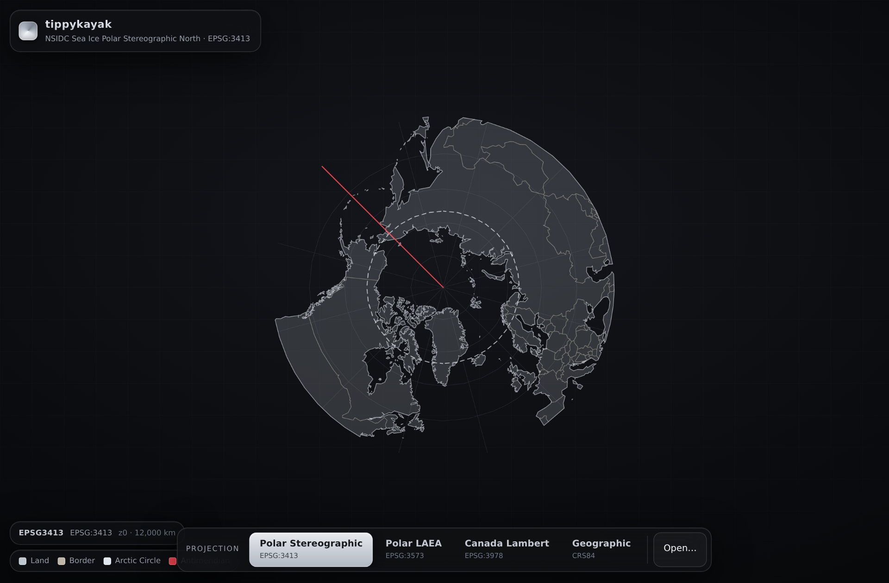

# tippykayak

**Non-WebMercator PMTiles, built on [morecantile](https://developmentseed.org/morecantile/) TileMatrixSets.**

Most vector-tile tooling only ever emits the **Web Mercator** (`WebMercatorQuad`)
tiling scheme. tippykayak generates beautiful, well-balanced PMTiles on *any* OGC
TileMatrixSet — **polar** or **geographic** — so you can tile and render data in a
CRS where Web Mercator is wrong: the Arctic (EPSG:3413 / EPSG:3573), Canada Atlas
Lambert (EPSG:3978), and beyond. It simplifies, drops, and clusters large datasets
entirely in the projected space of the chosen grid.

```bash
pip install -e .
tippykayak sites.geojson out.pmtiles --tms EPSG3978 --maxzoom 8
```

---

## Why this project exists (the research that shaped it)

Three findings drove the design. They're worth stating up front because they
rule out the "obvious" approaches.

### 1. The front-end is OpenLayers, **not** MapLibre

- **MapLibre GL JS cannot render non-WebMercator vector tiles.** It always
  renders EPSG:3857. Non-Mercator projections — "load and display vector tiles
  produced in custom coordinate systems," "specify EPSG + tile matrix set" — are
  on the [roadmap](https://maplibre.org/roadmap/maplibre-gl-js/non-mercator-projection/)
  but unimplemented.
- **OpenLayers can, today.** It supports `VectorTile` sources with a custom
  `proj4` projection and a custom `TileGrid`, and has official examples for
  [geographic/OGC vector tiles](https://openlayers.org/en/latest/examples/ogc-vector-tiles-geographic.html)
  and [reprojected vector tiles](https://openlayers.org/en/latest/examples/vector-tiles-reprojected.html).

So tippykayak ships an **OpenLayers** viewer (`viewer/index.html`).

### 2. PMTiles is projection-agnostic but **CRS-blind**

The [PMTiles](https://docs.protomaps.com/pmtiles/) format is just a
Hilbert-ordered z/x/y archive. Its header carries zoom/bounds/center but **no CRS
field** — a reader must already know the tiling scheme. tippykayak therefore
embeds the full TileMatrixSet description in the metadata JSON (a
`crs` / `tile_origin_upper_left_x|y` / `tile_dimension_zoom_0` convention) **plus
a `proj4` string and WKT**, so a projection-aware client can configure itself for
any CRS — even one it has never seen — with no hardcoded lookup table.

### 3. Non-Mercator output has to be generated natively

The common trick for bending a Web-Mercator-only tiler — pre-warping coordinates
to fake EPSG:4326 output — breaks tile addressing and **cannot** express
azimuthal/polar or conic projections: you can't make Mercator's fixed math
emulate polar stereographic or Lambert conformal conic. So the tiling, simplify,
drop, and clustering all have to happen in the target CRS from the start.

**Conclusion:** tippykayak is a from-scratch, projection-agnostic tiler in Python
with morecantile as the grid backbone, paired with an OpenLayers front-end.

---

## How it works

```
GeoJSON (lon/lat)  ──┐
OSM / Geofabrik     │  classify OSM tags → class/subclass via a theme (osm.py)
 .osm.pbf  ─────────┘
   │  reproject every geometry into the TMS's CRS (pyproj), repairing any
   │  reprojection-induced invalidity (common with real coastlines)
   ▼
projected features ── simplify (Douglas-Peucker, scaled per-zoom)
   │               ── drop (size + zoom-stable dot-dropping)
   │               ── clip to each tile (with edge buffer)
   ▼
MVT per tile (mapbox-vector-tile, quantized to the tile's CRS bounds)
   │  gzip
   ▼
PMTiles archive  +  embedded TileMatrixSet metadata
   │
   ▼
OpenLayers viewer  (proj4 projection + matching TileGrid)
```

Every decision — tile placement, simplification tolerance, feature size
thresholds — is made in the **projected CRS units** of the chosen grid, never in
Web Mercator. That is the whole point.

| Capability | tippykayak |
| --- | --- |
| Simplify | ✅ Douglas-Peucker, tolerance scaled to each zoom's ground resolution |
| Drop (by size) | ✅ features smaller than ~N pixels switch on at the first zoom they're visible |
| Drop (by density) | ✅ deterministic, zoom-stable dot-dropping for points |
| Aggregate / cluster | ✅ grid clustering with `point_count` + sum/mean/min/max accumulation |
| Input formats | ✅ GeoJSON **and** OpenStreetMap / Geofabrik `.osm.pbf` |
| Any TileMatrixSet | ✅ — the reason the project exists |

---

## Usage

### CLI

```bash
# List available grids (tippykayak's custom grids first, then morecantile's)
tippykayak --list-tms

# Arctic grids: EPSG:3413 (NSIDC polar stereographic) and EPSG:3573 (North Pole LAEA)
tippykayak data.geojson out.pmtiles --tms EPSG3413 --maxzoom 8
tippykayak data.geojson out.pmtiles --tms EPSG3573 --maxzoom 8

# Canada Atlas Lambert (EPSG:3978, conic) / plain WGS84
tippykayak data.geojson out.pmtiles --tms EPSG3978 --maxzoom 8
tippykayak data.geojson out.pmtiles --tms WorldCRS84Quad

# Tuning the simplify/drop behaviour
tippykayak data.geojson out.pmtiles --tms EPSG3413 \
  --simplify-pixels 1.0 --min-feature-pixels 1.5 --point-retain 0.6
```

### OpenStreetMap / Geofabrik `.osm.pbf` input

Point tippykayak at a [Geofabrik](https://download.geofabrik.de/) extract (or any
`.osm.pbf`) and it tiles it onto **whatever grid you choose** — the OSM data is
read in lon/lat and reprojected into the TMS's CRS exactly like GeoJSON, so it
works on the polar and conic grids too, not just Web Mercator.

```bash
# Auto-detected by the .osm.pbf / .pbf extension — same command, OSM in
tippykayak canada-latest.osm.pbf out.pmtiles --tms EPSG3978 --maxzoom 12

# Trim a big extract to a lon/lat box, and tile the Arctic on a polar grid
tippykayak iceland.osm.pbf ice.pmtiles --tms EPSG3573 --maxzoom 10 \
  --bbox -25,63,-13,67
```

OSM's free-form tags are mapped to a small, tile-friendly schema by a **theme**.
The built-in *general basemap* theme flattens everything into a **single layer**
where each feature carries a `class` (and `subclass`, plus `name` when tagged):

| `class` | geometry | OSM tags |
| --- | --- | --- |
| `coastline` | line | `natural=coastline` |
| `waterway` | line | `waterway=river/stream/canal/drain/ditch` |
| `road` | line | `highway=motorway…track/path` |
| `place` | point | `place=city/town/village/hamlet/locality/island` |
| `water` | area | `natural=water/bay`, `waterway=riverbank/dock`, `landuse=reservoir/basin` |
| `wetland` | area | `natural=wetland` |
| `landuse` | area | `landuse=*`, `natural=wood/scrub/glacier/…` |
| `building` | area | `building=*` |

Style on `class`/`subclass` in the viewer. Override the mapping with a JSON theme
(a list of `{"class","geometry","key","values"?}` rules, first match wins):

```bash
tippykayak region.osm.pbf water.pmtiles --tms EPSG3978 --theme my-theme.json
```

> **Memory:** like the GeoJSON path, the whole input is held in memory. Use
> regional/sub-regional Geofabrik extracts (or `--bbox`) rather than a
> continent-sized planet file.

### Point clustering / aggregation

Instead of dropping points as you zoom out, **cluster** them — nearby points
merge into one representative carrying a count (and optional accumulated
attributes). Counts are conserved across every zoom; clusters split apart as you
zoom in.

```bash
tippykayak settlements.geojson out.pmtiles --tms EPSG3413 \
  --cluster \
  --cluster-distance 44 \
  --cluster-weight population \
  --accumulate sum:population \
  --accumulate max:population
```

Each `--accumulate OP:FIELD[:OUT]` adds an aggregated field (`OP` is
`sum|mean|min|max|count`). Clusters always get a `point_count`, and
`--cluster-weight FIELD` places each cluster at its **centre of mass** weighted by
that field rather than the plain centroid. Cells are inherently zoom-nested (the
cell size halves exactly each zoom), so members stay together as you zoom. These
custom grids are built in (alongside everything morecantile ships):

| id | CRS | projection | extent |
| --- | --- | --- | --- |
| `EPSG3413` | EPSG:3413 | NSIDC polar stereographic (true at 70°N) | ±4 194 304 m (NASA GIBS) |
| `EPSG3573` | EPSG:3573 | North Pole LAEA (Canada, lon₀ −100°) | ±4 889 334.88 m (edge at 45°N) |
| `EPSG3978` | EPSG:3978 | NAD83 / Canada Atlas Lambert (conformal conic) | square, framing Canada |

### Python

```python
from tippykayak import Grid, TileOptions, build, Aggregation, Accumulation

grid = Grid.named("EPSG3573")
build("settlements.geojson", "out.pmtiles", grid,
      TileOptions(
          layer="arctic", min_zoom=0, max_zoom=8,
          aggregation=Aggregation(
              enabled=True, distance_pixels=36,
              accumulate=(Accumulation.parse("sum:population"),),
          ),
      ))
```

---

## Try the demo

```bash
pip install -e .
python examples/make_canada.py           # infrastructure sites → canada-3978 PMTiles
python examples/make_arctic.py           # settlements → arctic-3413 + arctic-3573 PMTiles
python serve.py                          # range-capable static server, port 8000
# open http://localhost:8000/viewer/index.html
```



The flagship demo draws **Natural Earth coastlines** for context and tiles ~720
synthetic infrastructure sites (sampled *on land*) onto **EPSG:3978** (Canada
Atlas Lambert). Dense areas glow as density-coloured clusters; individual sites
show a glyph for their category — airport, power, radio, or military. The Arctic
demo does the same on **EPSG:3413** (polar stereographic) and **EPSG:3573** (North
Pole LAEA). Clusters split apart as you zoom in.

## The viewer

`viewer/` is a **reusable** OpenLayers front-end for non-WebMercator PMTiles — not
just the demo. It opens *any* tippykayak archive and configures itself from the
metadata the tiler embeds: the **proj4 string** (registered with proj4js), the
tile grid (origin + zoom-0 span), the CRS extent, and the layer list. No
per-dataset code and no hardcoded CRS table — point it at an archive in a
projection it has never seen and it just works.

Open an archive four ways:

- the **demo** quick-picks (Canada Lambert + Arctic ×2),
- a remote **URL** (needs CORS + HTTP Range on the host),
- a **local `.pmtiles` file** (picker or drag-and-drop onto the map),
- a **`?src=…`** query parameter, e.g. `viewer/index.html?src=../examples/canada-3978.pmtiles`.

Styling adapts to geometry type — polygons filled, lines stroked. Point
`point_count` clusters render as soft, density-coloured **glow** blobs (gently
sized, no labels); at the deepest zoom, individual sites show a **category glyph**.
The pre-built, CDN-free bundle lives in `viewer/dist/`; rebuild with
`npm run build:viewer`.

> **Why not `python -m http.server`?** PMTiles is read with HTTP **Range**
> requests, which Python's stock server ignores — it returns the whole file and
> PMTiles breaks for any archive past its first read. `serve.py` adds Range
> support. (`npx http-server` or any range-capable server works too.)

### Rebuilding the viewer bundle

The viewer is pre-bundled into `viewer/dist/` (OpenLayers + proj4 + pmtiles +
ol-pmtiles, no CDN). To rebuild after editing `viewer/src/main.js`:

```bash
npm install
npm run build:viewer
```

---

## Status

The end-to-end path (GeoJSON **or OSM/Geofabrik `.osm.pbf`** →
polar/geographic/conic PMTiles → OpenLayers) works and is verified (pytest for
the tiler, clustering, and OSM ingestion; headless-browser render checks for the
viewer across the Canada and Arctic grids). Simplify, both drop strategies, and
**clustering aggregation** are implemented, on any morecantile or custom
TileMatrixSet. Next on the roadmap: FlatGeobuf input, polygon-area-aware
dropping, and label-collision handling in the viewer.

## Layout

```
src/tippykayak/
  tms.py        grid math on morecantile + custom grids (EPSG3413/3573/3978)
  features.py   load GeoJSON/OSM (by extension), reproject into the grid CRS
  osm.py        read .osm.pbf (pyosmium) + theme: OSM tags → class/subclass
  tiler.py      simplify / drop / cluster / clip → tile pyramid
  aggregate.py  point clustering + attribute accumulation
  encode.py     MVT encode + gzip
  archive.py    PMTiles writer + TMS metadata
  pipeline.py   end-to-end orchestration
  cli.py        command-line entry point
viewer/
  src/main.js       reusable OpenLayers viewer (URL / file / ?src=, self-configuring)
  dist/             pre-built, CDN-free bundle (committed)
  index.html        loads the bundle
serve.py            range-capable static server (PMTiles needs byte serving)
examples/
  make_canada.py    Canada demo: coastlines + categorised sites (EPSG:3978)
  make_arctic.py    Arctic demo: coastlines + clustered settlements (3413/3573)
  data/             Natural Earth land (public domain), committed source data
tests/              pytest suite
```

## License

MIT
